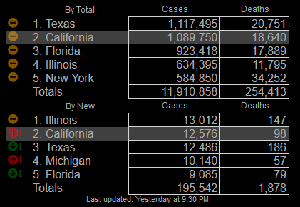

# MMM-CountDown

This is a module for the [MagicMirror²](https://github.com/MichMich/MagicMirror/) to display Covid counts for the United States, source from the [COVID-19 Data Repository by the Center for Systems Science and Engineering (CSSE) at Johns Hopkins University](https://github.com/CSSEGISandData/COVID-19) for the 2019 Novel Coronavirus; updated daily.



## Why?
This was the first module I wrote, and as there wasn't a module to display this information -- no matter how morbid -- it was an idea that gave me an excuse to learn.

## How?
### Manual install

1. Clone this repository in your `modules` folder:
  ```bash
  cd ~/MagicMirror/modules # adapt directory if you are using a different one
  git clone https://github.com/daterrell/MMM-JHCOVID19.git
  ```
2. Add the module to your `config/config.js` file.
  ```js
  {
    module: 'MMM-JHCOVID19',
    position: 'top_left',
    config: {
        // See configuration options
    }
  },
  ```

## Configuration options

| Option | Description |
|:----------:|:-------------|
| `updateInterval` | *Optional* How frequently to update (default: 60000ms == 1hr) |
| `alwaysShowState`| *Optional* State name to always show, despite its rank (default: California) |
| `highlightState` | *Optional* State name to highlight (default: California) |
